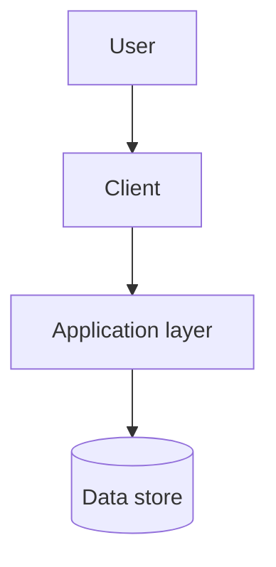

# Architecture

This document is written **after** the [charter](project-charter.md) and the
[requirements](requirements.md), because it exists to satisfy them. Designing
the system first and reverse-engineering the requirements to fit is the most
common way a capstone ends up with an architecture nobody can justify.

**Status:** draft — not yet written.

## Overview

Replace the placeholder diagram below once the shape of the system is actually
known. It shows the generic case only; the real one should name the actual
pieces and show anything unusual about how they talk to each other.

## Components

| Component | Responsibility | Notes |
| --- | --- | --- |
| _Client_ | _What the user interacts with_ | _To be written._ |
| _Application layer_ | _Where the rules live_ | _To be written._ |
| _Data store_ | _What persists, and where_ | _To be written._ |

## Data model

<!--
The entities, their fields, and the relationships between them. A small
diagram or table beats prose. Keep this consistent with the "Data" section of
the requirements — if they disagree, one of them is wrong.
-->

_To be written._

## Key flows

<!--
Walk the two or three most important paths through the system end to end —
from the user's action to the stored result and back. These are what expose
missing components, and what a reviewer will ask you to talk through.
-->

_To be written._

## Technology choices

Each significant choice belongs in an [ADR](decisions/) recording the context,
the alternatives and the reasons — this table is only a summary of where those
decisions currently stand.

| Area | Choice | ADR |
| --- | --- | --- |
| Language / runtime | _Undecided_ | [ADR-0002](decisions/0002-technology-stack.md) |
| Data store | _Undecided_ | [ADR-0002](decisions/0002-technology-stack.md) |
| Hosting | _Undecided_ | [ADR-0002](decisions/0002-technology-stack.md) |

## Security and privacy

Secrets — API keys, tokens, database credentials — come from environment
variables and are **never committed**. Commit a `.env.example` listing the
variable names with dummy values so a reviewer knows what to set.

The repository's [`.gitignore`](../.gitignore) enforces the mechanical half of
this by keeping `.env` files and key material out of commits. It cannot catch
a secret pasted into source, a config file or a document, so the habit matters
more than the file. If a secret is ever committed, treat it as compromised and
rotate it — deleting the commit does not un-publish it.

Beyond secrets, record here: what the trust boundaries are, what is validated
where, and how the privacy commitments in the requirements are actually
enforced in the design.

_To be written._
